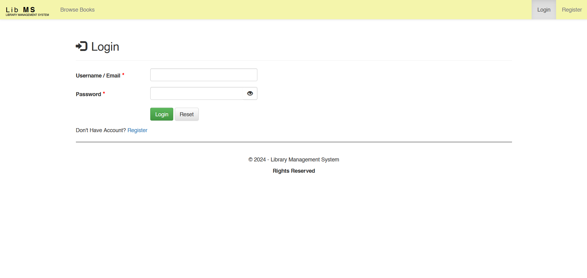
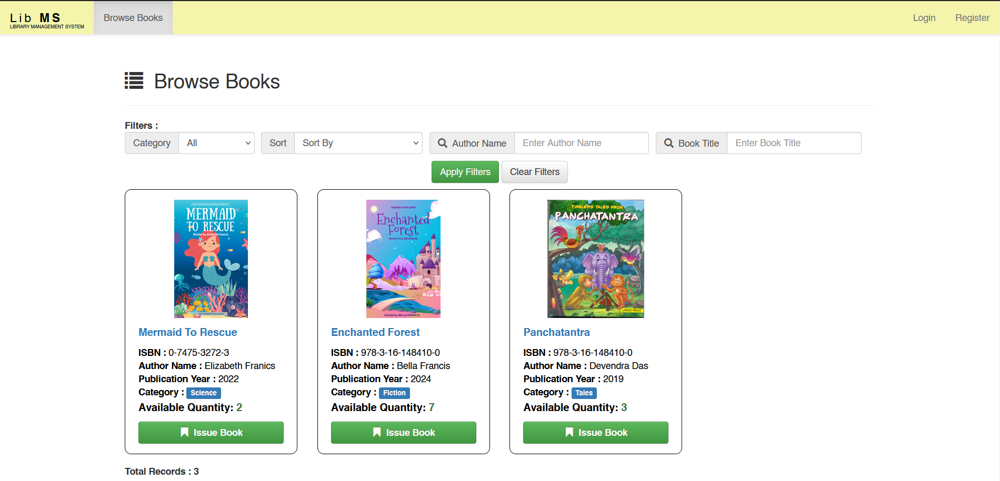
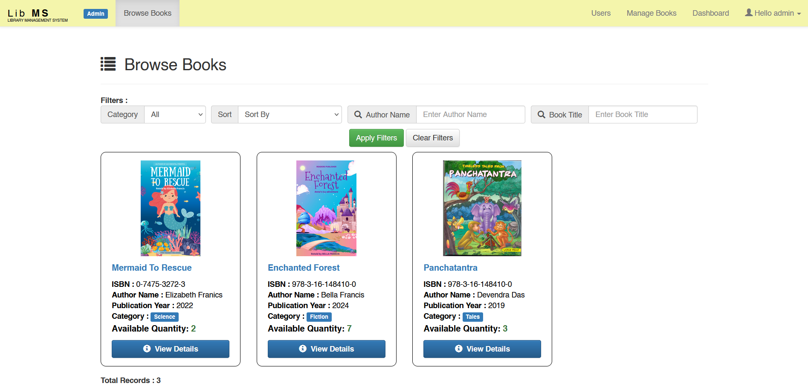
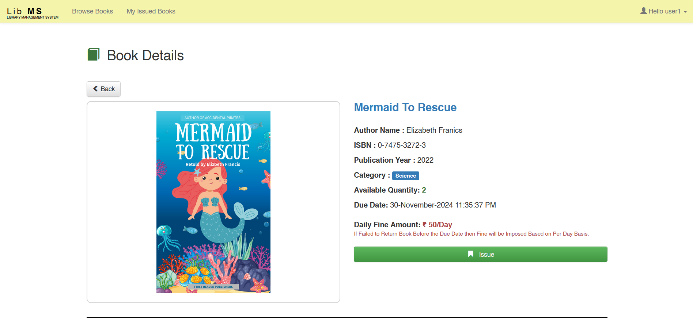
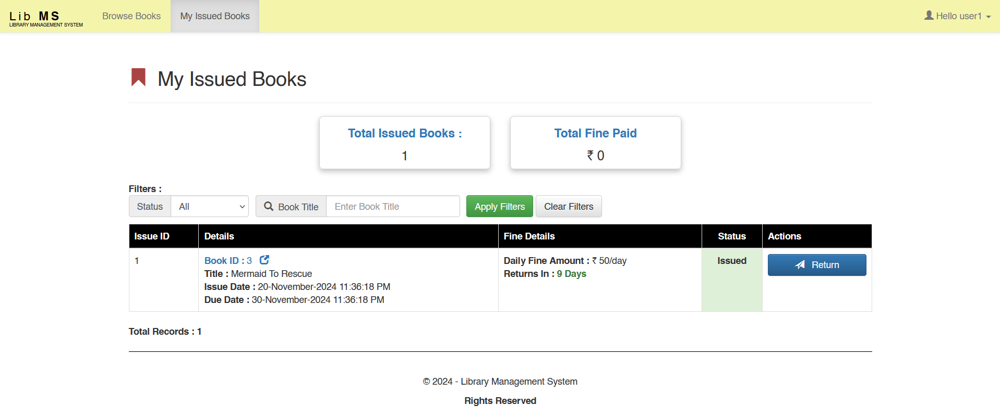
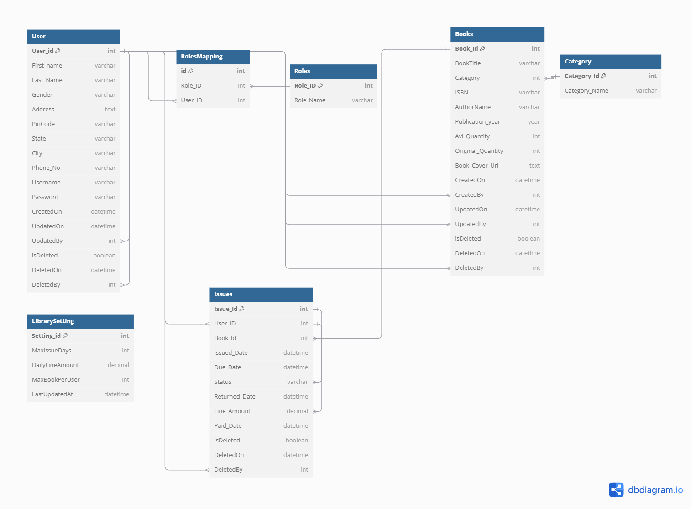

# Library Management System


A comprehensive web-based application developed using .NET Framework 4.8 and MVC5 with a SQL Server backend. The frontend is designed with Bootstrap 3.4.1 for responsive UI and jQuery for dynamic interactions.

### Features:

1. Admin:
   - Manage users and books.
   - Configure library settings, including:
     - Maximum books a user can issue.
     - Fine amount for overdue books.
     - Loan duration for issued books.
2. Librarian:
   - Manage book inventory (add, update, delete books).
   - Access a dashboard to monitor issued and returned books.
3. User:
   - Issue and return books.
   - Pay fines for overdue returns to regain borrowing privileges.

### Screenshots:

1. Login Page
   

2. Browse Book Page
   

3. Browse Book on Admin Page
   

4. Book Details
   

5. Books Issued by User
   

### Output Video : [Click Here](https://www.youtube.com)

### System Tables Architecture Diagram:



### Installation / Setup:

1. Creating the Database or Running the Scripts:
    - Make sure you have installed the Microsoft SQL Server Database. 
    - Just run the Script Present in file `SQLScripts/Creation_Scripts.sql`

2. Open the Project which is `MVC_Task` on Microsoft Visual Studio or any IDE. 

    1. Make some Changes in the `Web.config` file

    ```
    <add name="database" connectionString="Server=localhost;Database=databasename;Trusted_Connection=true;TrustServerCertificate=True;Data Source=datasource_name"/>

    ```

    2. Don't Change Anything Else. Otherwise there may be some chances of getting the error while running the project.

    3. Before it Install all the required dependencies from the `Nuget Package Manager`.

3. Run the Project 
4. If you want to login as the Admin Enter the below Credentials
    ```
    Username: admin
    Passsword: admin@123
    ```


## Author: Prathamesh Dhande
